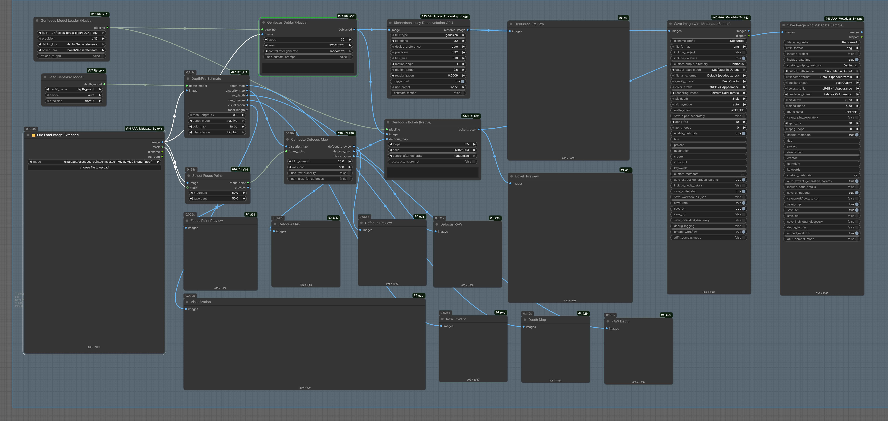
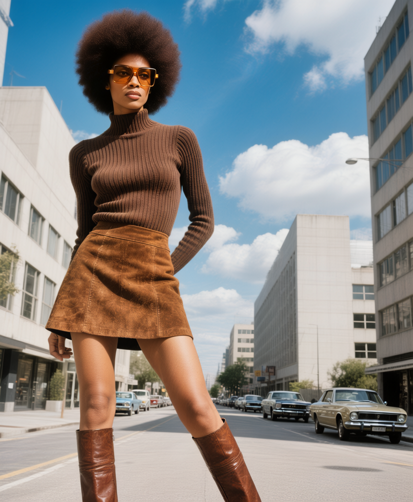
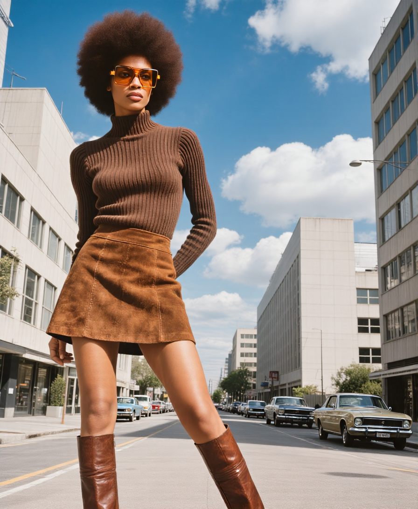
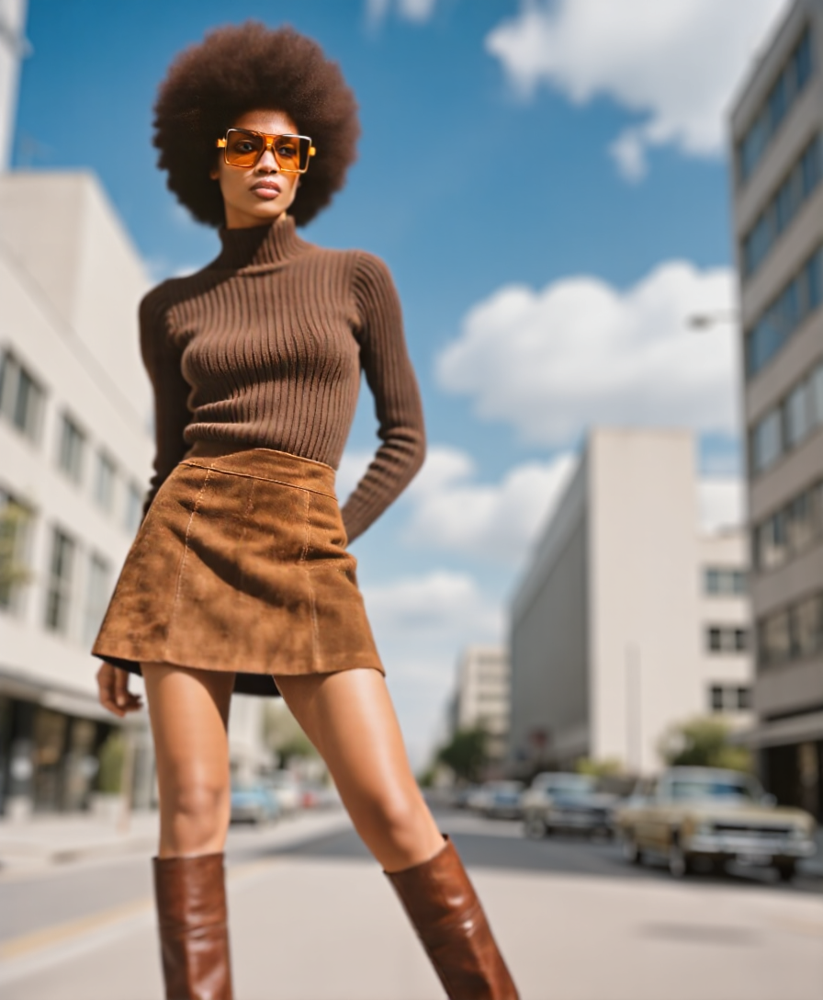
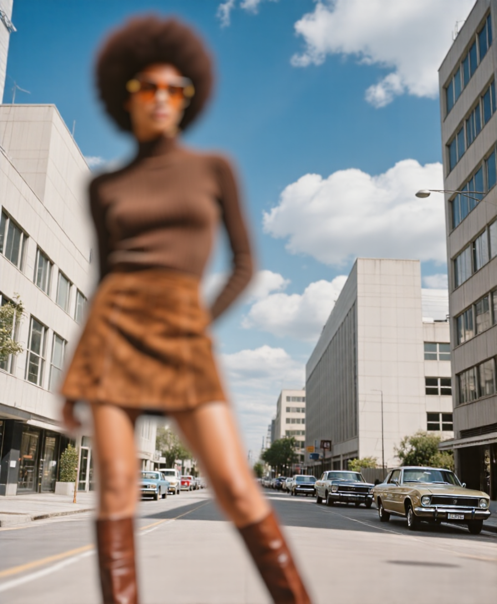

# Refocus - ComfyUI Nodes for Generative Refocusing

ComfyUI custom nodes for the [Genfocus](https://github.com/rayray9999/Genfocus) generative refocusing pipeline.

Transform any photo into a professional-looking image with controllable depth-of-field (bokeh) effects!

## Features

- **DeblurNet**: Restore all-in-focus images from blurry/defocused inputs
- **BokehNet**: Generate realistic depth-of-field effects with controllable focus
- **DepthPro**: High-quality metric depth estimation (Apple ml-depth-pro)
- **Depth Utilities**: Convert between depth formats, focal length calculations

---

## Installation

### 1. Clone the Repository
```bash
cd ComfyUI/custom_nodes
git clone <this-repo> Refocus
```

### 2. Install Base Dependencies
```bash
pip install safetensors
```

### 3. Install DepthPro (Optional - for depth estimation)
```bash
pip install git+https://github.com/apple/ml-depth-pro.git --no-deps
pip install pillow_heif
```

### 4. Install Native Genfocus Dependencies (Recommended)
```bash
pip install diffusers transformers accelerate peft
```

---

## Model Setup

### Folder Structure
```
ComfyUI/
├── models/
│   ├── genfocus/                    ← Genfocus LoRAs
│   │   ├── deblurNet.safetensors
│   │   └── bokehNet.safetensors
│   ├── diffusers/                   ← FLUX model (diffusers format)
│   │   └── FLUX.1-dev/
│   │       ├── model_index.json
│   │       ├── transformer/
│   │       └── ...
│   └── checkpoints/
│       └── depth_pro.pt             ← DepthPro weights
```

### Download Links

| Model | Size | License | Download |
|-------|------|---------|----------|
| Genfocus LoRAs | ~35MB | Apache 2.0 | [HuggingFace](https://huggingface.co/rayray9999/Genfocus) |
| DepthPro | ~500MB | Apple Sample Code | [HuggingFace](https://huggingface.co/apple/ml-depth-pro) |
| FLUX.1-dev | ~23GB | Non-Commercial | [HuggingFace](https://huggingface.co/black-forest-labs/FLUX.1-dev) |

---

## Node Reference

## Genfocus Nodes (diffusers-based)

These nodes use the full Genfocus implementation with proper multi-conditional LoRA support.

### Genfocus Model Loader (Native)
Loads FLUX.1-dev with Genfocus LoRA adapters.

| Input | Type | Description |
|-------|------|-------------|
| `flux_model` | dropdown | Local diffusers model or HuggingFace ID |
| `precision` | dropdown | bf16 (recommended), fp16, fp32 |
| `deblur_lora` | dropdown | DeblurNet LoRA from models/genfocus/ |
| `bokeh_lora` | dropdown | BokehNet LoRA from models/genfocus/ |
| `offload_to_cpu` | boolean | Enable CPU offloading to save VRAM |

| Output | Type | Description |
|--------|------|-------------|
| `pipeline` | GENFOCUS_PIPELINE | Loaded pipeline for generation |

---

### Genfocus Unload Models
Manually unload Genfocus models from VRAM/RAM. Useful for freeing memory between runs.

| Input | Type | Description |
|-------|------|-------------|
| `trigger` | * | Any input to trigger execution |
| `unload_flux` | BOOLEAN | Unload FLUX pipeline |
| `unload_depth_pro` | BOOLEAN | Unload DepthPro model |
| `clear_cuda_cache` | BOOLEAN | Clear CUDA cache after unload |

| Output | Type | Description |
|--------|------|-------------|
| `status` | STRING | Status message |

---

### Genfocus Deblur (Native)
**Convenience node** - takes a blurry image and outputs a sharp, all-in-focus result.

| Input | Type | Description |
|-------|------|-------------|
| `pipeline` | GENFOCUS_PIPELINE | From Genfocus Model Loader |
| `image` | IMAGE | Blurry/defocused input image |
| `steps` | INT | Denoising steps (default: 28) |
| `seed` | INT | Random seed |

| Output | Type | Description |
|--------|------|-------------|
| `deblurred` | IMAGE | Sharp, all-in-focus result |

---

### Genfocus Bokeh (Native)
**Convenience node** - applies realistic bokeh to a sharp image using a defocus map.

| Input | Type | Description |
|-------|------|-------------|
| `pipeline` | GENFOCUS_PIPELINE | From Genfocus Model Loader |
| `image` | IMAGE | Sharp input image |
| `defocus_map` | IMAGE | Grayscale blur intensity map |
| `steps` | INT | Denoising steps (default: 28) |
| `seed` | INT | Random seed |
| `max_coc` | FLOAT | Maximum circle of confusion (blur strength) |

| Output | Type | Description |
|--------|------|-------------|
| `bokeh_result` | IMAGE | Image with bokeh effect |

---

### Genfocus Generate (Native)
**Advanced node** - full control over multi-conditional generation.

| Input | Type | Description |
|-------|------|-------------|
| `pipeline` | GENFOCUS_PIPELINE | From Genfocus Model Loader |
| `prompt_preset` | dropdown | deblur, bokeh, or custom |
| `width` / `height` | INT | Output size (default: 1024x1024) |
| `steps` | INT | Denoising steps |
| `guidance_scale` | FLOAT | CFG scale (1.0 = no CFG) |
| `seed` | INT | Random seed |
| `condition_1/2/3` | GENFOCUS_CONDITION | Image conditions (optional) |
| `latents` | LATENT | Starting latents (optional, leave empty) |
| `main_adapter` | dropdown | auto, deblurring, bokeh, none |

| Output | Type | Description |
|--------|------|-------------|
| `image` | IMAGE | Generated result |

---

### Genfocus Condition
Creates a condition from an image for use with Genfocus Generate.

| Input | Type | Description |
|-------|------|-------------|
| `image` | IMAGE | Input image |
| `adapter` | dropdown | deblurring or bokeh |
| `position_delta_x/y` | INT | Position offset for the condition |
| `scale` | FLOAT | Condition strength |

| Output | Type | Description |
|--------|------|-------------|
| `condition` | GENFOCUS_CONDITION | Condition for generation |

---

### Genfocus Defocus Map Condition
Creates a condition from a defocus map for bokeh generation.

| Input | Type | Description |
|-------|------|-------------|
| `defocus_map` | IMAGE | Grayscale defocus map |
| `max_coc` | FLOAT | Maximum blur radius |

| Output | Type | Description |
|--------|------|-------------|
| `condition` | GENFOCUS_CONDITION | Defocus condition |

---

## Depth & Utility Nodes

These standalone utility nodes work independently and can be used with any workflow.

### Load DepthPro Model
Loads Apple's ml-depth-pro model for depth estimation.

| Input | Type | Description |
|-------|------|-------------|
| `model_path` | dropdown | Path to depth_pro.pt |
| `use_relative_depth` | boolean | Output relative (0-1) or metric depth |

### DepthPro Estimate
Generates depth maps from images.

| Input | Type | Description |
|-------|------|-------------|
| `depth_model` | DEPTH_PRO_MODEL | From Load DepthPro Model |
| `image` | IMAGE | Input image |

| Output | Type | Description |
|--------|------|-------------|
| `depth_map` | IMAGE | Depth visualization (colorized) |
| `disparity_map` | IMAGE | Inverse depth visualization |
| `raw_depth` | IMAGE | Unnormalized metric depth (meters) |
| `raw_inverse` | IMAGE | Unnormalized inverse depth |
| `visualization` | IMAGE | 3-panel analysis (image, depth, histogram) |
| `focal_length` | FLOAT | Estimated focal length in pixels |

---

### Depth Metric to Relative
Convert raw metric depth to normalized 0-1 range. **Works with any depth source.**

| Input | Type | Description |
|-------|------|-------------|
| `depth` | IMAGE | Raw depth map (from DepthPro, Marigold, etc.) |
| `per_image` | BOOLEAN | Normalize each batch image independently |
| `invert` | BOOLEAN | Flip near/far (near=bright for ControlNet) |
| `gamma` | FLOAT | Brightness bias (>1 = brighter midtones) |

| Output | Type | Description |
|--------|------|-------------|
| `relative_depth` | IMAGE | Normalized 0-1 depth map |

---

### Depth Metric to Inverse
Simple inverse depth conversion: `1/(1+depth)`. Compresses far distances.

| Input | Type | Description |
|-------|------|-------------|
| `depth` | IMAGE | Raw metric depth |

| Output | Type | Description |
|--------|------|-------------|
| `inverse_depth` | IMAGE | Inverse depth map |

---

### Focal Length PX to MM
Convert DepthPro's pixel-based focal length to millimeters.

| Input | Type | Description |
|-------|------|-------------|
| `focal_px` | FLOAT | Focal length in pixels |
| `sensor_mm` | FLOAT | Sensor size in mm (default: 24mm) |
| `image_width/height` | INT | Image dimensions |

| Output | Type | Description |
|--------|------|-------------|
| `focal_mm` | FLOAT | Focal length in mm |
| `focal_str` | STRING | Formatted string (e.g., "50.00mm") |

---

### Focal Length MM to PX
Convert real camera focal length to pixels for DepthPro input.

| Input | Type | Description |
|-------|------|-------------|
| `focal_mm` | FLOAT | Focal length in mm (from EXIF) |
| `sensor_mm` | FLOAT | Sensor size in mm |
| `image_width/height` | INT | Image dimensions |

| Output | Type | Description |
|--------|------|-------------|
| `focal_px` | FLOAT | Focal length in pixels |
| `focal_str` | STRING | Formatted string |

---

### Compute Defocus Map
Calculates blur intensity from depth and focus settings.

| Input | Type | Description |
|-------|------|-------------|
| `disparity` | IMAGE | From DepthPro |
| `focus_disparity` | FLOAT | Focus plane (0-1) |
| `aperture` | FLOAT | Blur strength |
| `max_blur` | FLOAT | Maximum blur radius |

### Select Focus Point
Select focus point using sliders OR a mask input for interactive selection.

| Input | Type | Description |
|-------|------|-------------|
| `image` | IMAGE | Input image |
| `mask` | MASK | **Optional** - from SAM, MaskPainter, etc. Centroid becomes focus point |
| `x_percent` / `y_percent` | FLOAT | Percentage coordinates (0-100), ignored if mask provided |

| Output | Type | Description |
|--------|------|-------------|
| `focus_point` | FOCUS_POINT | Focus coordinates for defocus map |
| `preview` | IMAGE | Image with crosshair at focus point |

> **💡 Tip:** Connect a mask from **Impact Pack's SAM Detector** or **MaskPainter** for interactive point-and-click focus selection!

### Focus Point From Mask
Extract focus point from any mask source. Great for interactive workflows!

| Input | Type | Description |
|-------|------|-------------|
| `image` | IMAGE | Input image |
| `mask` | MASK | Mask from SAM, MaskPainter, or any source |
| `fallback_x/y` | FLOAT | Fallback position if mask is empty |

| Output | Type | Description |
|--------|------|-------------|
| `focus_point` | FOCUS_POINT | Focus coordinates |
| `preview` | IMAGE | Preview with mask overlay and crosshair |
| `x` / `y` | INT | Pixel coordinates (for debugging) |

#### Interactive Focus Selection Workflow
```
┌─────────────┐     ┌─────────────────────┐     ┌─────────────────────┐
│ Load Image  │────▶│ SAM Detector        │────▶│ Focus Point From    │
│             │     │ (Impact Pack)       │     │ Mask                │
└─────────────┘     │                     │     │                     │
                    │ Click on your       │     │ Extracts centroid   │
                    │ focus target!       │     │ from mask           │
                    └─────────────────────┘     └─────────────────────┘
                                                          │
                                                          ▼
                                                ┌─────────────────────┐
                                                │ Compute Defocus Map │
                                                └─────────────────────┘
```

---

## Example Workflows

Ready-to-use workflow files are in the `workflows/` folder. Download the JSON files or drag the PNG workflow images directly into ComfyUI!

---

### 🔄 Refocus Workflow

**Files:** 
- `Refocus-Eric-1225.json` / `Refocus-Eric-1225.png` (workflow)
- Input: `HunyuanImage3_2025-12-11_17-30-15_000.png`

This workflow demonstrates the complete refocusing pipeline: deblur an image first, then selectively refocus to create professional depth-of-field effects.

#### Workflow Diagram


#### Input Image
The starting image was generated with Hunyuan Image 3 (NF4). It has a soft, natural background blur — similar to what you'd get from a small format camera at f/8.



#### Results

| Result | Description |
|--------|-------------|
|  | **Deblurred** — Extended depth of field from foreground to infinity. Notice how both the subject and background are now sharp. |
|  | **Refocus 1** — Focus on subject's face using a small mask mark. The background is blurred to make the subject stand out. Adjust `blur_strength` and `max_coc` for more dramatic separation. |
|  | **Refocus 2** — Creative example: focus shifted to the 2nd car in the background. The subject is now artistically blurred. |

#### Key Concepts

- **Deblur** sharpens everything — extends depth of field from foreground to infinity
- **Refocus** shifts the focal plane to wherever you mark with a mask or set with [x,y] coordinates
- `max_coc` and `blur_strength` in the Compute Defocus node control how much blur is applied outside the depth of field

---

### 🔍 Simple Deblur Workflow

**Files:**
- `Deblur_Eric_1225_simple.json` / `Deblur_Eric_1225_simple.png` (workflow)
- Input: `HunyuanImage3_2025-12-20_00-59-02_000.png`

A minimal workflow for deblurring images with very few adjustable parameters — perfect for automation or batch processing.

#### Workflow Diagram


#### Before & After

| Input | Output |
|-------|--------|
|  |  |
| Original image with natural background blur | Deblurred result with sharp foreground and background |

#### Notes

- The input image (generated with Hunyuan Image 3) has a subtle, natural-looking background blur
- The deblurred result brings both foreground and background elements into sharp focus
- For additional sharpening, consider using a Richardson-Lucy deconvolution node as a final step (after upscaling)
- **Minimal configuration required** — great for automation pipelines
- Works best with images around 1 megapixel (FLUX.1-dev native resolution), though FLUX handles larger sizes reasonably well
- Increasing the number of steps can provide slight quality improvements

---

### Simple Deblur Workflow Diagram
```
┌─────────────────┐     ┌─────────────────────┐     ┌─────────────────────┐
│   Load Image    │────▶│ Genfocus Model      │────▶│ Genfocus Deblur     │
│                 │     │ Loader (Native)     │     │ (Native)            │
└─────────────────┘     │                     │     │                     │
                        │ flux_model: local:  │     │ steps: 28           │
                        │ deblur_lora: ✓      │     │ seed: 42            │
                        └─────────────────────┘     └─────────────────────┘
                                                              │
                                                              ▼
                                                    ┌─────────────────────┐
                                                    │   Save Image        │
                                                    └─────────────────────┘
```

### Full Bokeh Pipeline Diagram
```
┌─────────────────┐     ┌─────────────────────┐
│   Load Image    │────▶│ Genfocus Model      │
└─────────────────┘     │ Loader (Native)     │
        │               └──────────┬──────────┘
        │                          │
        │               ┌──────────▼──────────┐
        ├──────────────▶│ Genfocus Deblur     │──────┐
        │               │ (Native)            │      │
        │               └─────────────────────┘      │
        │                                            │
        ▼                                            ▼
┌─────────────────┐     ┌─────────────────────┐     ┌─────────────────────┐
│ Load DepthPro   │────▶│ DepthPro Estimate   │     │ Sharp Image         │
│ Model           │     │                     │     │                     │
└─────────────────┘     └──────────┬──────────┘     └──────────┬──────────┘
                                   │                           │
                                   ▼                           │
                        ┌─────────────────────┐               │
                        │ Select Focus Point  │               │
                        │ x: 0.5, y: 0.5      │               │
                        └──────────┬──────────┘               │
                                   │                           │
                                   ▼                           │
                        ┌─────────────────────┐               │
                        │ Compute Defocus Map │               │
                        │ aperture: 2.0       │               │
                        └──────────┬──────────┘               │
                                   │                           │
                                   ▼                           ▼
                        ┌─────────────────────────────────────────┐
                        │           Genfocus Bokeh (Native)       │
                        │                                         │
                        │  image: ─────────────────────────────●  │
                        │  defocus_map: ───────────────────────●  │
                        │  steps: 28                              │
                        └──────────────────────┬──────────────────┘
                                               │
                                               ▼
                                    ┌─────────────────────┐
                                    │   Final Bokeh       │
                                    │   Result            │
                                    └─────────────────────┘
```

---

## Understanding the Defocus Map

The defocus map controls how much blur is applied to each pixel based on its distance from the focus plane. This is the key to creating realistic bokeh effects.

### How the Defocus Map Works

The defocus map is computed using this formula:

```
blur = K × |depth - depth_at_focus|
```

Where:
- **K** = `blur_strength` parameter
- **depth** = normalized depth value at each pixel (0-1)
- **depth_at_focus** = depth value at your selected focus point

The result is clamped to `max_coc` and normalized to 0-1 for the Genfocus network.

### Compute Defocus Map Outputs

| Output | Description |
|--------|-------------|
| **defocus_preview** | Normalized 0-1 for visualization (full contrast stretch) |
| **defocus_map** | What Genfocus actually uses (clamped at max_coc) |
| **defocus_raw** | Raw blur values before normalization |

### Parameter Reference

| Parameter | Effect | Higher Value | Lower Value |
|-----------|--------|--------------|-------------|
| **blur_strength (K)** | How fast blur increases with depth difference | More aggressive depth-dependent blur | Gentler blur gradient |
| **max_coc** | Maximum blur radius cap (Circle of Confusion) | Allows extreme blur far from focus | Caps blur earlier (subtler effect) |

### Recommended Settings

| Effect | blur_strength | max_coc | Notes |
|--------|---------------|---------|-------|
| Subtle portrait | 10-20 | 64 | Gentle background softening |
| Standard bokeh | 20-30 | 100 | Good for most photos |
| Dramatic tilt-shift | 40-60 | 150 | Strong miniature effect |
| Extreme separation | 60-100 | 200+ | Very shallow DOF look |

### What is Circle of Confusion (CoC)?

In real photography, the **Circle of Confusion** is the maximum size of a point of light that will still appear "sharp" to the human eye. In Genfocus:

- **max_coc** sets the upper limit on blur intensity (in normalized units)
- Higher max_coc = allows more extreme blur for objects far from focus
- Lower max_coc = gentler, more subtle blur even at depth extremes

### Troubleshooting Low Contrast Defocus Maps

If your defocus map appears very dark or low-contrast, **this may be intentional!**

**Original Genfocus behavior:** The original implementation does NOT normalize the defocus map to full 0-1 range. Looking at demo.py:
```python
dmf = K * |disparity - disparity_focus|
cond_map = (dmf / MAX_COC).clamp(0, 1)  # Often results in 0-0.2 range!
```

The network was trained with this convention, so dark defocus maps are normal for subtle bokeh effects.

**Options to control intensity:**

| Method | Description |
|--------|-------------|
| **Increase blur_strength (K)** | Try 30-60 for more visible effect |
| **Enable `normalize_for_genfocus`** | NEW! Stretches output to full 0-1 range |
| **Use `defocus_preview`** | Already normalized for visualization |

**normalize_for_genfocus option:**
- **False (default)**: Original Genfocus behavior - dark maps, subtle bokeh
- **True**: Stretches to full 0-1 range - may produce stronger/different bokeh effects (experimental)

### Does the Bokeh Node Change the Image If Focus Matches Original?

**Yes, slightly.** Even if you select a focus point matching the original photo's focus:
- The FLUX diffusion process inherently modifies the image during generation
- Very small depth differences still create tiny blur values
- The result may appear slightly softer overall

**Tip:** If you want NO change to already-sharp areas, ensure your defocus map is truly zero there (check the preview).

---

## Tips for Better Quality

### Getting Finer Details

1. **Increase inference steps** - Try 32-50 steps for more refined output
2. **Use higher resolution** - FLUX works best at 1024x1024 or higher
3. **Run deblur first** - Always deblur before applying bokeh for sharpest results
4. **Lower guidance_scale** - Try 2.5-3.0 for a more natural look (less "AI" appearance)
5. **Post-process with Richardson-Lucy** - The deconvolution node can recover additional detail

### Understanding the Workflow Order

For best results, follow this order:

```
Original Image → Deblur → Depth Estimation → Focus Selection → Defocus Map → Bokeh
```

1. **Deblur** restores a sharp base image (important!)
2. **Depth Estimation** analyzes the scene structure
3. **Focus Selection** picks where you want sharpness
4. **Defocus Map** calculates blur intensity per-pixel
5. **Bokeh** applies the learned depth-of-field effect

### Why Deblur First?

The Genfocus bokeh network expects a **sharp input**. If you skip deblurring:
- The network has to work harder to generate sharp in-focus areas
- The original blur mixes with the generated bokeh unpredictably
- Results will be softer than intended

---

## Tips & Troubleshooting

### VRAM Usage
- FLUX.1-dev requires ~24GB VRAM at bf16
- Enable `offload_to_cpu` to reduce VRAM (slower)
- Use fp16 if bf16 is not supported

### Image Dimensions
- FLUX native resolution: **1024x1024**
- Other sizes work but may have quality differences
- Keep dimensions multiples of 16

### Common Issues

| Problem | Solution |
|---------|----------|
| "diffusers not found" | `pip install diffusers transformers accelerate peft` |
| "FLUX model not found" | Place in `models/diffusers/FLUX.1-dev/` or use HF login |
| "LoRA not loading" | Check files are in `models/genfocus/` folder |
| Out of memory | Enable `offload_to_cpu` or use smaller resolution |

---

## Licenses

| Component | License | Commercial Use |
|-----------|---------|----------------|
| Refocus nodes | Apache 2.0 | ✅ Yes |
| Genfocus LoRAs | Apache 2.0 | ✅ Yes |
| Apple ml-depth-pro | Apple Sample Code | ⚠️ Research only |
| FLUX.1-dev | Non-Commercial | ❌ Requires license |

---

## Technical Notes

### Why Diffusers Instead of Native ComfyUI FLUX?

We initially attempted to create a native ComfyUI sampler that would allow using **any FLUX fine-tune** loaded in ComfyUI with Genfocus LoRAs. This would have been ideal — no need for a separate diffusers FLUX download, and compatibility with all FLUX variants.

**The challenge:** Genfocus LoRAs were trained on the **diffusers FLUX architecture**, which uses separate Q, K, V projection layers:
```
transformer.single_transformer_blocks.0.attn.to_q
transformer.single_transformer_blocks.0.attn.to_k
transformer.single_transformer_blocks.0.attn.to_v
```

ComfyUI's FLUX implementation uses **fused QKV layers** for efficiency:
```
single_blocks.0.linear1  ← Contains Q, K, V, and MLP fused together
```

Applying LoRA weights trained for separate Q/K/V to a fused layer requires:
1. Splitting the LoRA weights to the correct offsets within the fused layer
2. Ensuring the math works out correctly for the different projections

We implemented key mapping and offset-based patching using ComfyUI's built-in mechanisms, but the results showed characteristic spotted corruption patterns, indicating the LoRA weights weren't being applied correctly to the fused architecture.

**Current status:** The native ComfyUI sampler approach is **abandoned for now**. The diffusers-based nodes work correctly because they use the exact architecture the LoRAs were trained on.

**Future possibility:** If someone trains Genfocus-style LoRAs directly on ComfyUI's FLUX architecture, or develops proper weight conversion utilities, native sampling could become viable.

---

## Credits

- **Genfocus**: [NYCU CP Lab](https://github.com/rayray9999/Genfocus) - Core algorithm and LoRAs
- **Paper**: [Generative Refocusing of Radiance Fields](https://arxiv.org/abs/2512.16923)
- **ml-depth-pro**: [Apple](https://github.com/apple/ml-depth-pro) - Depth estimation
- **FLUX**: [Black Forest Labs](https://blackforestlabs.ai/) - Base model

## Citation

```bibtex
@article{Genfocus2025,
  title={Generative Refocusing: Flexible Defocus Control from a Single Image},
  author={Tuan Mu, Chun-Wei and Huang, Jia-Bin and Liu, Yu-Lun},
  journal={arXiv preprint arXiv:2512.16923},
  year={2025}
}
```
